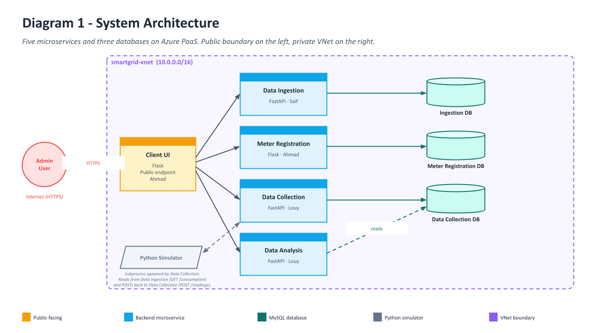
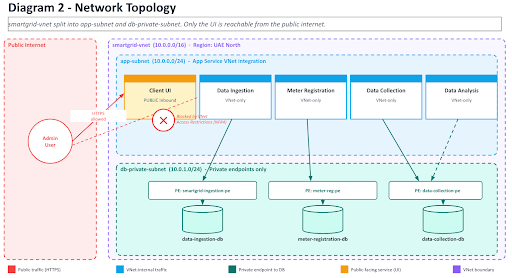
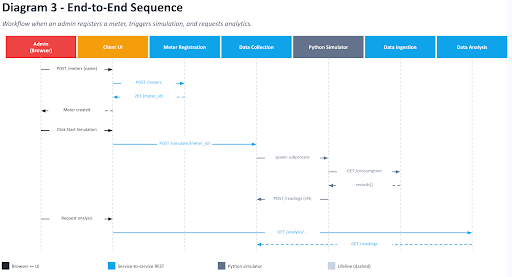

# SmartGrid Insights

> CMP404 Spring 2026 · Team 5 · American University of Sharjah  
> Saifeldin Hassan · Louy Abbas · Ahmad Bilal

A cloud-based platform for analyzing household electricity consumption patterns, built as five independently deployed microservices on **Azure App Service** with **Azure SQL** databases. Administrators can register smart meters, simulate data collection from a historical dataset, and run consumption analytics — all from a single web interface.

---

## Repositories

| # | Service | Owner | Stack | Repo |
|---|---------|-------|-------|------|
| 1 | **Data Ingestion** | Saif | FastAPI · SQLAlchemy · Azure SQL | [smartgrid-data-ingestion](https://github.com/LouayYa/smartgrid-data-ingestion) |
| 2 | **Meter Registration** | Ahmad | Flask · SQLAlchemy · Azure SQL | [meter-registration-service](https://github.com/LouayYa/meter-registration-service) |
| 3 | **Data Collection** | Louy | FastAPI · SQLAlchemy · Azure SQL | [smartgrid-data-collection](https://github.com/LouayYa/smartgrid-data-collection) |
| 4 | **Data Analysis** | Louy | FastAPI · Requests | [smartgrid-data-analysis](https://github.com/LouayYa/smartgrid-data-analysis) |
| 5 | **Client Interface** | Ahmad | Flask · Jinja2 | [smartgrid-ui](https://github.com/LouayYa/smartgrid-ui) |

---

## System Architecture

Five microservices and three databases on Azure PaaS. The Client UI is the only public-facing service — all backend services and databases are VNet-private.



---

## Network Topology

The VNet (`smartgrid-vnet`, `10.0.0.0/16`) is split into an app-subnet for App Service VNet integration and a db-private-subnet for private endpoints to each Azure SQL database. Only the Client UI has a public inbound endpoint.



---

## End-to-End Data Flow



1. **Register a meter** — Client UI → `POST /meters` → Meter Registration Service → Meter Registration DB
2. **Trigger simulation** — Client UI → `POST /simulate/{meter_id}` → Data Collection Service
3. **Simulate readings** — Data Collection Service spawns the Python Simulator, which calls `GET /consumption` on the Data Ingestion Service and `POST /readings` back to Data Collection Service
4. **Store readings** — Data Collection Service persists each reading (tagged with `meter_id`) to the Data Collection DB
5. **Analyze** — Client UI → Data Analysis Service (`/analysis/averages`, `/analysis/peaks`, `/analysis/categories`) → queries Data Collection DB → returns computed results

---

## Databases

| Database | Owned By | Table | Key Columns |
|----------|----------|-------|-------------|
| Ingestion DB | Data Ingestion | `household_power_consumption` | `ID`, `Date`, `Time`, `Global_active_power`, `Voltage`, `Sub_metering_1/2/3` |
| Meter Registration DB | Meter Registration | `meters` | `meter_id`, `name`, `created_at` |
| Data Collection DB | Data Collection | `readings` | `reading_id`, `meter_id`, `timestamp`, `global_active_power`, `voltage`, `sub_metering_1/2/3` |

---

## CI/CD

Every service deploys automatically to Azure App Service via **GitHub Actions**, configured through Azure Deployment Center. A push to `main` triggers build → deploy.

| Service | Workflow Status |
|---------|----------------|
| Data Ingestion |  |
| Meter Registration |  |
| Data Collection |  |
| Data Analysis |  |
| Client Interface |  |

---

## Local Development

Each service has its own `.env` — refer to the `.env.example` in each repo. The inter-service URLs you'll need:

```env
# Data Collection Service
DATA_INGESTION_URL=http://localhost:8001

# Data Analysis Service
DATA_COLLECTION_URL=http://localhost:8002

# Client Interface
METER_SERVICE_URL=http://localhost:8000
COLLECTION_SERVICE_URL=http://localhost:8002
ANALYSIS_SERVICE_URL=http://localhost:8003
```

Default ports: Meter Registration `8000` · Data Ingestion `8001` · Data Collection `8002` · Data Analysis `8003` · Client UI `8004`

---

## Dataset

[UCI Household Power Consumption](https://archive.ics.uci.edu/ml/datasets/Individual+household+electric+power+consumption) — 260,640 minute-level readings, January 1 – June 30, 2007. Loaded into the Ingestion DB via `POST /api/v1/load`.

---

> Part of **SmartGrid Insights** — CMP404 Spring 2026 · Team 5
