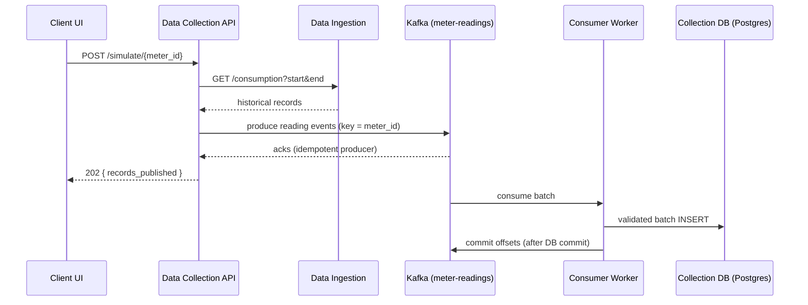

# SmartGrid Insights

> CMP404 Spring 2026 · Team 5 · American University of Sharjah  
> Saifeldin Hassan · Louy Abbas · Ahmad Bilal

An event-driven platform for analyzing household electricity consumption, built as five independently deployed **Python microservices** (FastAPI + Flask). Smart-meter readings stream through a **Kafka** topic into **PostgreSQL** (schemas versioned with **Alembic**), an **Airflow** batch pipeline maintains precomputed daily analytics served back over the API, and the whole system runs on **Docker Compose** or **Kubernetes** with one command. Every service ships a **pytest suite behind a CI coverage gate (≥80%)**, request logging, and optional API-key auth.

```
simulator / API ──► Kafka (meter-readings) ──► consumer ──► PostgreSQL ──► on-demand analytics API
                                                                │
                                                     Airflow @daily aggregates ──► precomputed analytics API
```

**History:** originally deployed on **Azure App Service** with **Azure SQL** (decommissioned to cut hosting costs — the CI deploy jobs remain as reference). The platform was then migrated to PostgreSQL and containerized, and has since grown the Kafka write path, Airflow batch layer, Kubernetes manifests, and test/migration discipline documented below.

---

## Repositories

| # | Service | Owner | Stack | Repo |
|---|---------|-------|-------|------|
| 1 | **Data Ingestion** | Saif | FastAPI · SQLAlchemy · PostgreSQL | [smartgrid-data-ingestion](https://github.com/LouayYa/smartgrid-data-ingestion) |
| 2 | **Meter Registration** | Ahmad | Flask · SQLAlchemy · PostgreSQL | [meter-registration-service](https://github.com/LouayYa/meter-registration-service) |
| 3 | **Data Collection** | Louy | FastAPI · Kafka · SQLAlchemy · PostgreSQL | [smartgrid-data-collection](https://github.com/LouayYa/smartgrid-data-collection) |
| 4 | **Data Analysis** | Louy | FastAPI · Requests | [smartgrid-data-analysis](https://github.com/LouayYa/smartgrid-data-analysis) |
| 5 | **Client Interface** | Ahmad | Flask · Jinja2 | [smartgrid-ui](https://github.com/LouayYa/smartgrid-ui) |

This repository also contains a full snapshot of every service plus the Docker Compose orchestration, so the entire system can be cloned and run from one place:

```
.
├── docker-compose.yml                  # One-command local orchestration
├── .env.example                        # Template for required secrets (copy to .env)
├── db/init/                            # Creates the per-service Postgres databases
├── airflow/dags/                       # Batch pipelines (daily aggregates, dataset load)
├── smart-data-ingestion/               # Data Ingestion (FastAPI, port 8001)
├── smartgrid-meter-registration/       # Meter Registration (Flask, port 8000)
├── smartgrid-data-collection/          # Data Collection (FastAPI, port 8002)
├── smartgrid-data-analysis/            # Data Analysis (FastAPI, port 8003)
└── smartgrid-UI/                       # Client Interface (Flask, port 8004)
```

---

## Quick Start (Docker Compose)

Run the whole platform locally — five services, a Kafka broker (KRaft, no ZooKeeper), a readings consumer worker, an Airflow batch scheduler + UI, and a shared Postgres 16 instance — with one command.

```bash
git clone https://github.com/LouayYa/SmartGrid-Insights.git
cd SmartGrid-Insights

# Secrets are NOT hardcoded — copy the template and set your own values.
cp .env.example .env      # then edit .env and set POSTGRES_PASSWORD

docker compose up --build
```

Then open the UI at **http://localhost:8004** and the **Airflow UI at http://localhost:8080** (login from `.env`). To seed the dataset, trigger the `ingest_dataset` DAG in Airflow (or call `POST http://localhost:8001/api/v1/load` directly), register a meter in the UI, and trigger a simulation.

The database password is injected everywhere from the `POSTGRES_PASSWORD` variable in `.env` (which is gitignored) — nothing secret lives in `docker-compose.yml`.

---

## Run on Kubernetes

The full platform also deploys to Kubernetes from the manifests in [`k8s/`](k8s/) — Deployments with `/health` liveness/readiness probes and resource limits, StatefulSets for Postgres and Kafka, ConfigMap/Secret separation, and startup Alembic migrations. Verified end-to-end on a local [kind](https://kind.sigs.k8s.io) cluster:

```bash
kind create cluster --name smartgrid
sh k8s/kind-build-load.sh
kubectl apply -k k8s/
kubectl -n smartgrid port-forward svc/ui 8004:8004
```

[`k8s/README.md`](k8s/README.md) has the details plus the documented **GCP path** (Artifact Registry → GKE Autopilot, with Cloud SQL / Managed Kafka / Cloud Composer as the managed swap-ins).

---

## System Architecture (original Azure deployment)

The diagrams below document the original Azure PaaS deployment: five microservices and three databases, with the Client UI as the only public-facing service — all backend services and databases VNet-private. The same topology now runs locally on the compose network (`smartgrid`), with the three Azure SQL databases replaced by per-service databases on a shared Postgres instance.

<p align="center">
  
</p>

---

## Network Topology (original Azure deployment)

The VNet (`smartgrid-vnet`, `10.0.0.0/16`) was split into an app-subnet for App Service VNet integration and a db-private-subnet for private endpoints to each Azure SQL database. Only the Client UI had a public inbound endpoint.

<p align="center">
  
</p>

---

## End-to-End Data Flow

<p align="center">
  
</p>

1. **Register a meter** — Client UI → `POST /meters` → Meter Registration Service → Meter Registration DB
2. **Trigger simulation** — Client UI → `POST /simulate/{meter_id}` → Data Collection Service
3. **Publish readings** — Data Collection Service fetches the historical window via `GET /consumption` on the Data Ingestion Service and publishes each reading as a JSON event to the **`meter-readings` Kafka topic**, keyed by `meter_id` (a standalone simulator client in `smartgrid-data-collection/simulator/` plays a real smart meter and produces to the same topic directly)
4. **Store readings** — the **readings consumer worker** (`collection-consumer` in compose) is the single DB writer: it validates each event, batch-inserts into the Data Collection DB, and commits Kafka offsets only after the database transaction succeeds (at-least-once delivery)
5. **Analyze** — Client UI → Data Analysis Service (`/analysis/averages`, `/analysis/peaks`, `/analysis/categories`) → queries Data Collection DB → returns computed results



---

## Batch Analytics (Airflow)

Two pipelines in [`airflow/dags/`](airflow/dags/), scheduled by an **Airflow 2.10** deployment (LocalExecutor, metadata DB on the shared Postgres):

| DAG | Schedule | What it does |
|-----|----------|--------------|
| `daily_consumption_aggregates` | `@daily` | Reads raw readings from the Collection DB and **upserts per-meter daily aggregates** (avg/peak power, sub-metering energy totals) into `analytics_daily`. Idempotent via `ON CONFLICT` on the `(meter_id, day)` key. Served by `GET /analysis/daily/{meter_id}` — constant-time regardless of range size, vs. the on-demand endpoints that aggregate raw readings per request. |
| `ingest_dataset` | manual | Idempotent (re)load of the UCI CSV into the ingestion DB, with retries and a row-count verification task. |

DAG validity tests live in `airflow/tests/` and run inside the container:
```bash
docker compose exec airflow-scheduler bash -c "pip install -q pytest && python -m pytest /opt/airflow/tests -v"
```

---

## Databases

| Database | Owned By | Table | Key Columns |
|----------|----------|-------|-------------|
| Ingestion DB | Data Ingestion | `household_power_consumption` | `ID`, `Date`, `Time`, `Global_active_power`, `Voltage`, `Sub_metering_1/2/3` |
| Meter Registration DB | Meter Registration | `meters` | `meter_id`, `name`, `created_at` |
| Data Collection DB | Data Collection | `readings` | `reading_id`, `meter_id`, `timestamp`, `global_active_power`, `voltage`, `sub_metering_1/2/3` |

---

## CI/CD

Every push to `main` triggers **GitHub Actions** in each service repo: dependencies install and the service's pytest suite runs with a **coverage gate** (configured per-service in `pyproject.toml`, ≥80%), blocking the pipeline on failure. Database schemas are versioned with **Alembic migrations** — each stateful service runs `alembic upgrade head` on startup instead of `create_all()`. The deploy-to-Azure jobs (originally wired through Azure Deployment Center) are kept as reference implementations but only run on a manual `workflow_dispatch` trigger, since the Azure hosting was decommissioned.

| Service | Workflow Status |
|---------|----------------|
| Data Ingestion |  |
| Meter Registration |  |
| Data Collection |  |
| Data Analysis |  |
| Client Interface |  |

---

## Local Development

Each service has its own `.env` — refer to the `.env.example` in each repo. The inter-service URLs you'll need:

```env
# Data Collection Service
DATA_INGESTION_URL=http://localhost:8001

# Data Analysis Service
DATA_COLLECTION_URL=http://localhost:8002

# Client Interface
METER_SERVICE_URL=http://localhost:8000
COLLECTION_SERVICE_URL=http://localhost:8002
ANALYSIS_SERVICE_URL=http://localhost:8003
```

Default ports: Meter Registration `8000` · Data Ingestion `8001` · Data Collection `8002` · Data Analysis `8003` · Client UI `8004` · Airflow `8080`

**Auth:** when `SMARTGRID_API_KEY` is set (see `.env.example`), every backend endpoint except `/health` and the docs requires that value in the `X-API-Key` header — the UI, inter-service calls, the simulator, and the Airflow DAGs all forward it automatically. Leave it empty to disable auth for local development.

---

## Dataset

[UCI Household Power Consumption](https://archive.ics.uci.edu/ml/datasets/Individual+household+electric+power+consumption) — 260,640 minute-level readings, January 1 – June 30, 2007. Loaded into the Ingestion DB via `POST /api/v1/load`.

---

> Part of **SmartGrid Insights** — CMP404 Spring 2026 · Team 5
